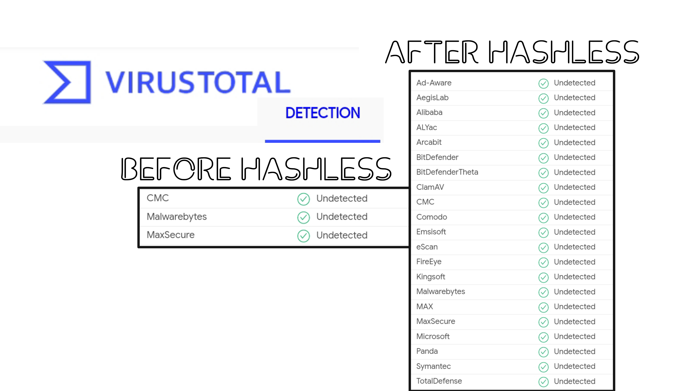

# Hashless
Hashless was designed by an independent security researcher from Australia, hell bent on bringing simple forgotten vulnerabilities to the light..    

## What is Hashles ?
* Hashless was originally designed as a File Binding solution for PHP, however that soon changed to fit my interest in how specific virus software handles virus detection.    
* This pho script was specifically designed to test the effectiveness of Hash Masking a virus and testing through the Virus Total website.

## How does it work ?
* First the user uploads a known file like a TEST virus file
* Second, the script binds a 6 byte file of 00000's to the end of the file 
* This new binded file has a masked hash and acts exactly the same as the original
* The virus software definition is checked and flaws are apparent with hash masking a virus

    
I made this POC to highlight something i just kind of imagined after reading how virus total detects viruses.   

    

- Kind Regards, Woke.      
    

      
    

## Technology   
* PHP   
* HTMl   

## Installation
* Copy to live PHP server and test 

    
## Development Notes    
* I'm not sure if "Hash Masking" is a real thing, i just made that word up because it fitted.

### Test A Pre-built Website with Bootstrap Theme
 

